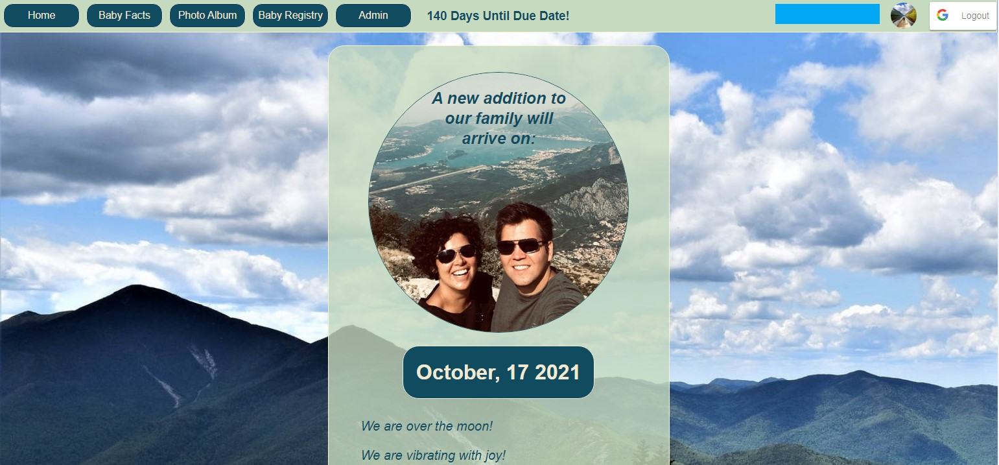

# Baby-App
## Prelude
Towards the end of my Full-Stack Web Development bootcamp at Concordia University I found out my wife was pregnant. At the time, I was looking for final projects ideas. That is when it hit me! I'll make a clone of UberEats! ...Then my wife reminded me we're having a baby and smacked some sense into me. What I actually made is a "baby website" where I've consolidated our baby registry, facts about how far along my wife is and I've integrated the Google Photos API that pulls photos from an album and shows them in the "Gallery" section. I have to limit access to the app due to privacy concerns, but see below snapshots and descriptions of all the features.

## Prelude
