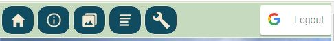
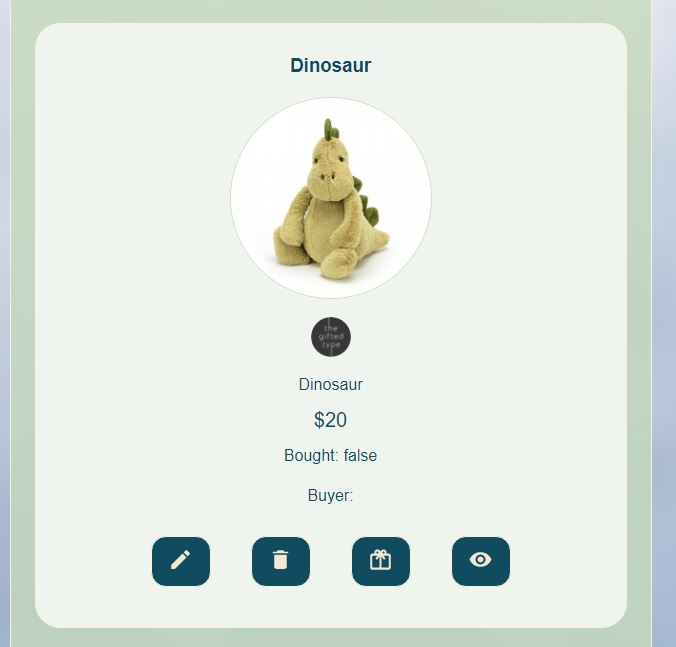
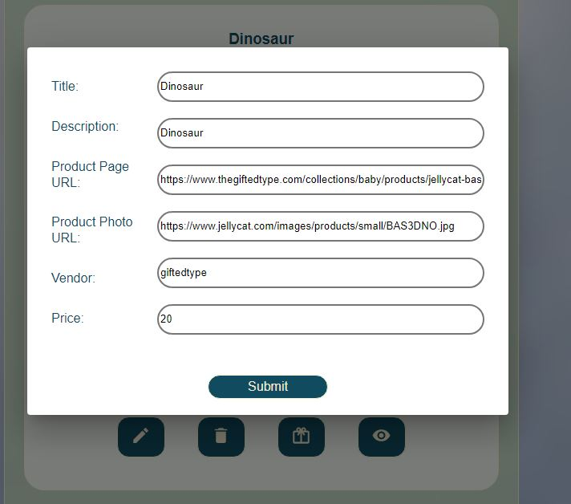
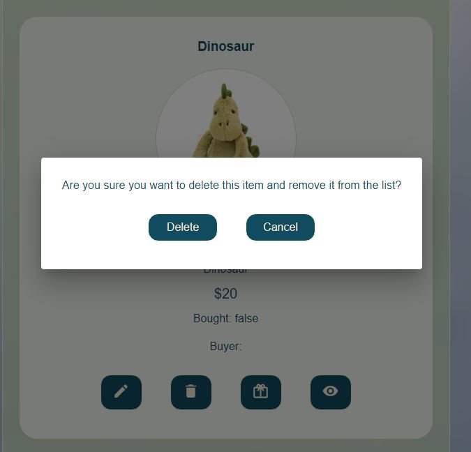
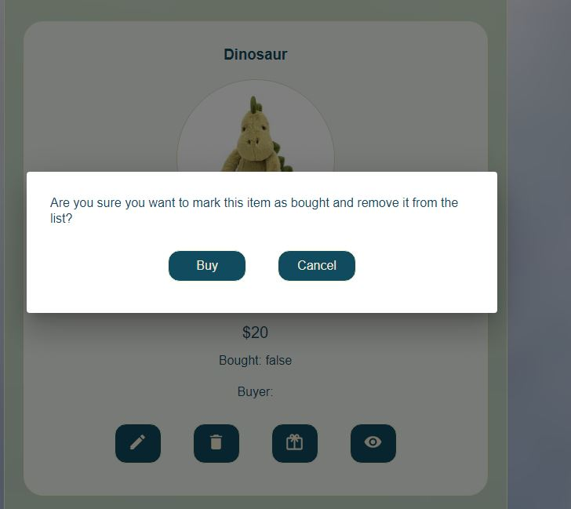
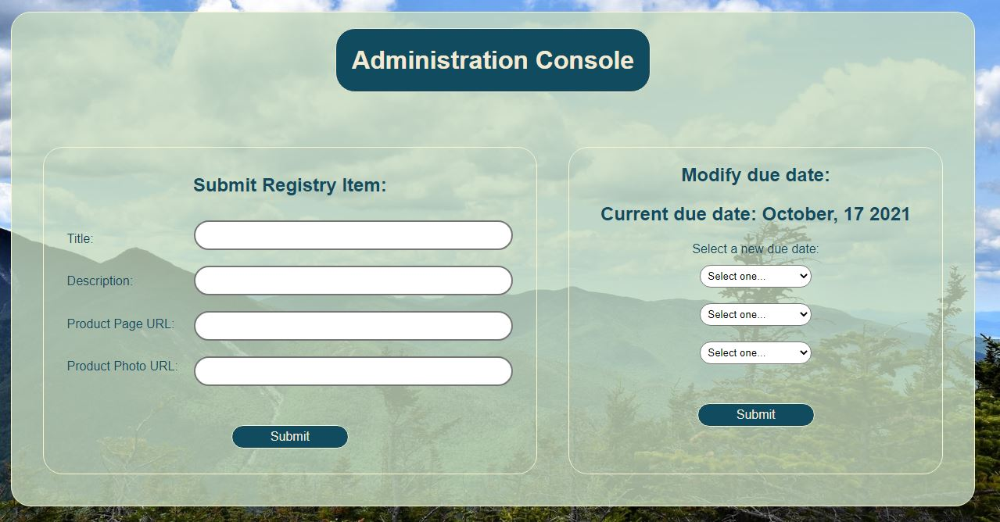
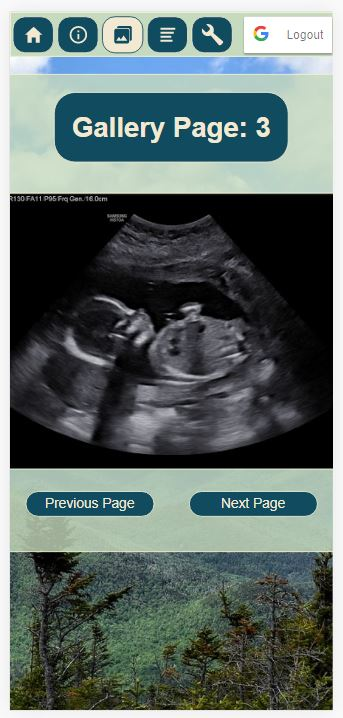
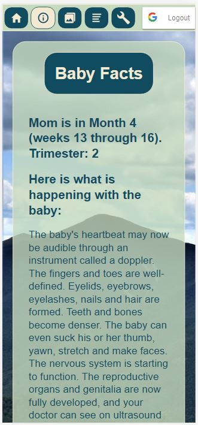

# Baby-App
## Prelude
Towards the end of my Full-Stack Web Development bootcamp at Concordia University I found out my wife was pregnant. At the time, I was looking for final projects ideas. That is when it hit me! I'll make a clone of UberEats! ...Then my wife reminded me we're having a baby and smacked some sense into me. What I actually made is a "baby website" where I've consolidated our baby registry, facts about how far along my wife is and I've integrated the Google Photos API that pulls photos from an album and shows them in the "Gallery" section. I have to limit access to the app due to privacy concerns, but see below snapshots and descriptions of all the features.

## MERN Stack, Netlify and Heroku
This is my first full MERN stack application. The frontend has been deployed on Netlify, the backend has been deployed on Heroku and the registry item database as well as a few other things are on MongoDB. Unfortunately, due to privacy concerns I don't want to have this website open to everyone, but hopefully the screenshots below will suffice. If you have any questions don't hesitate to contact me.

## Logging In
Since I didn't want any Joe looking at my baby registry, I've used the [React Google Login Package](https://www.npmjs.com/package/react-google-login) to handle user access.

## Navigation Bar
The navigation bar at the top allows the user to navigate easily whether they are on the desktop or on mobile versions of the website.
### Desktop

### Mobile

## Baby Fact
If you're interested in what stage of development the baby is at currently there is a "Baby Fact" section.

## Photo Gallery
I am using the [Google Photos API](https://developers.google.com/photos) to bring in photos from an album that I've shared to authorized users. This Google Photos API was a little challenging to figure out. Some of the challenges I encountered were:
* The Google Photos Album ID is different for every authorized user even though the album is the same.
* I had to figure out how to do pagination. I managed to do this on the frontend side.
* This was good practice in understanding access tokens.

## User Types
I have two types of users: admins and regular users. The difference being is that regular users can only view the registry and mark items bought (remove them from the list) whereas admins have the ability to:
* Add Registry Items
* Modify Registry Items
* Delete Registry Items

## Registry (Admin)
Here is what the admin user sees when he opens up the registry:

Below are the examples of the modals where I'm using [Material UI Dialog API](https://material-ui.com/api/dialog/).

## Admin Console
The admin console was my first iteration at adding Registry Items. I realized it would be more convenient to have the editing features right on the items itself. However, I left the options here for user preference. There is also an option here to change the due date if we ever have another baby!

## Mobile Friendly
The app is mobile friendly.

